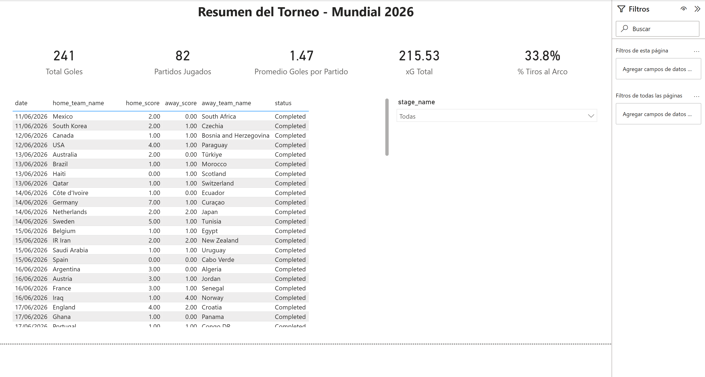
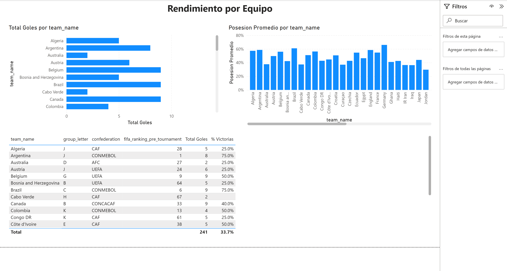
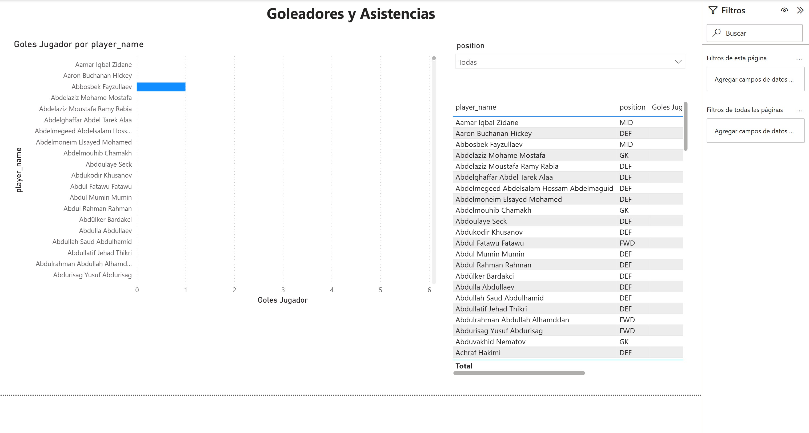
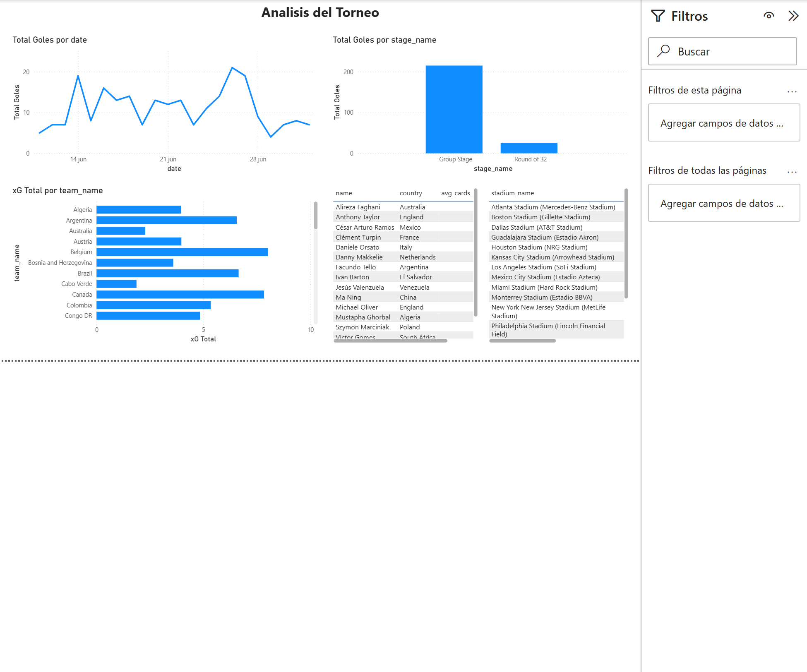
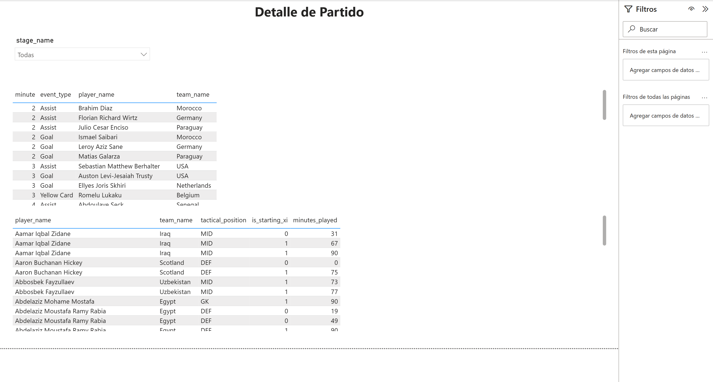

# Microsoft MCP PowerBI — Kit de integración para agentes de IA

[](https://github.com/SimonLexRS/Microsoft-MCP-PowerBI)
[](https://www.npmjs.com/package/@microsoft/powerbi-modeling-mcp)
[](https://www.npmjs.com/package/@microsoft/powerbi-report-authoring-cli)
[](https://www.npmjs.com/package/@microsoft/powerbi-desktop-bridge-cli)
[](https://github.com/SimonLexRS/Microsoft-MCP-PowerBI/stargazers)
[](LICENSE)

Kit completo para que un agente de IA (Claude, Copilot, Cursor u otro cliente
MCP) construya **modelos semánticos y dashboards de Power BI de punta a punta**
contra una instancia local de Power BI Desktop — incluyendo **edición de
visuales en vivo, sin cerrar el archivo**.

> ⚠️ **Requisito indispensable: modo Proyecto de Power BI (.pbip).** Todo el flujo de dashboards de este kit (escritura de visuales, `validate` y `reload` en vivo) depende de que el archivo esté guardado como **Power BI project files (*.pbip)** — nunca como `.pbix` clásico. Guárdalo así antes de conectar el agente: **Archivo > Guardar como > Power BI project files (*.pbip)**. Solo el modo proyecto genera las carpetas `*.Report/` (PBIR) y `*.SemanticModel/` (TMDL) que el agente necesita leer y escribir; con un `.pbix` normal, ninguna herramienta de dashboard de este kit puede operar.

Este kit integra y documenta tres herramientas oficiales de Microsoft
(el mérito de los paquetes es de Microsoft; este repo aporta la configuración,
el flujo de trabajo validado, los errores conocidos y sus fixes, y los
manuales para replicarlo en cualquier equipo):

| Componente | Paquete | Rol |
|---|---|---|
| **Servidor MCP** | [`@microsoft/powerbi-modeling-mcp`](https://www.npmjs.com/package/@microsoft/powerbi-modeling-mcp) | Modelo semántico: tablas, relaciones, medidas DAX, consultas — vía XMLA contra Power BI Desktop |
| **CLI de autoría** | [`@microsoft/powerbi-report-authoring-cli`](https://www.npmjs.com/package/@microsoft/powerbi-report-authoring-cli) | Validación de archivos PBIR y catálogo de visuales |
| **CLI puente Desktop** | [`@microsoft/powerbi-desktop-bridge-cli`](https://www.npmjs.com/package/@microsoft/powerbi-desktop-bridge-cli) | Abrir, **recargar en vivo** y capturar screenshots del reporte abierto |

## Capacidades

### Modelo semántico (vía MCP — 21 grupos de herramientas)

| Grupo | Herramientas | Qué permite |
|---|---|---|
| Conexión | `connection_operations` | Detectar instancias locales de Desktop y conectarse |
| Tablas y datos | `table_operations`, `partition_operations` | Crear tablas desde CSV (Power Query M), refrescar datos |
| Relaciones | `relationship_operations` | Crear/activar relaciones 1:N y 1:1 con dirección de filtro |
| Medidas y DAX | `measure_operations`, `dax_query_operations`, `function_operations` | Crear medidas, validar y ejecutar DAX en vivo |
| Columnas | `column_operations`, `user_hierarchy_operations` | Columnas calculadas, renombrado, jerarquías |
| Modelo | `model_operations`, `database_operations` | Refresh global, exportar TMDL/BIM, desplegar a Fabric |
| Avanzadas | `calculation_group_operations`, `calendar_operations`, `perspective_operations`, `security_role_operations`, `culture_operations`, `object_translation_operations`, `named_expression_operations`, `query_group_operations`, `trace_operations`, `transaction_operations` | Grupos de cálculo, calendarios, RLS, traducciones, trazas |

### Dashboard (vía CLIs — edición en vivo)

| Comando | Qué hace |
|---|---|
| `powerbi-report-author validate <dir .Report>` | Valida schema, estructura, IDs, roles y enums de los archivos PBIR **antes** de tocar Desktop |
| `powerbi-report-author catalog describe <tipo>` | Roles y propiedades reales de cada tipo de visual (sin adivinar) |
| `powerbi-desktop open <archivo.pbip>` | Abre el proyecto en Power BI Desktop |
| `powerbi-desktop status` | Instancias abiertas, PID, páginas del reporte |
| `powerbi-desktop reload --pid <pid>` | **Recarga los visuales en el Desktop abierto, sin cerrarlo** |
| `powerbi-desktop screenshot-all --pid <pid> --output-dir <dir>` | Captura todas las páginas para verificación automática |

## Arquitectura

```
┌─────────────────────┐        MCP (stdio)         ┌──────────────────────────┐
│   Agente de IA      │ ─────────────────────────► │ powerbi-modeling-mcp     │
│ (Claude / Copilot / │                            │  └─► XMLA :puerto local  │
│  Cursor / otro)     │        CLI (shell)         ├──────────────────────────┤
│                     │ ─────────────────────────► │ powerbi-desktop-bridge   │──┐
│                     │ ─────────────────────────► │ powerbi-report-authoring │  │
└─────────────────────┘                            └──────────────────────────┘  │
        │  escribe archivos PBIR (visual.json, pages.json)                       │
        ▼                                                                        ▼
┌──────────────────────────────┐   reload en vivo   ┌──────────────────────────┐
│ Proyecto .pbip en disco      │ ◄───────────────── │  Power BI Desktop        │
│  ├─ *.Report/ (visuales)     │                    │  (archivo ABIERTO)       │
│  └─ *.SemanticModel/ (TMDL)  │                    └──────────────────────────┘
└──────────────────────────────┘
```

## Galería — dashboards construidos con este kit

Dashboard multipágina generado 100% por un agente de IA con este flujo
(dataset de ejemplo: Mundial de fútbol 2026), verificado con los propios
screenshots del kit:

| Resumen con KPIs, tabla y slicer | Gráficos de barras y columnas |
|---|---|
|  |  |

| Ranking con slicer y tabla de stats | Serie temporal y análisis |
|---|---|
|  |  |

<details>
<summary>Ver página de detalle (tablas de eventos y alineaciones)</summary>


</details>

## Inicio rápido

```bash
# 1. Requisitos: Windows + Power BI Desktop + Node.js 20+
npm install -g @microsoft/powerbi-report-authoring-cli @microsoft/powerbi-desktop-bridge-cli

# 2. Clonar este kit y abrir el agente desde la carpeta
git clone https://github.com/SimonLexRS/Microsoft-MCP-PowerBI.git
cd Microsoft-MCP-PowerBI
claude   # el .mcp.json activa el servidor powerbi-modeling automáticamente

# 3. IMPORTANTE: usar modo Proyecto (.pbip), no .pbix
#    En Desktop: Archivo > Guardar como > Power BI project files (*.pbip)
# 4. Con el .pbip abierto en Desktop, pedirle al agente:
#    "Lista las instancias locales de Power BI Desktop y conéctate"
```

> ⚡ **Implementación asistida por IA:** [PROMPTS.md](PROMPTS.md#prompt-de-implementación-copiar-en-claude-o-chatgpt)
> incluye un prompt listo para pegar en Claude o ChatGPT que instala y
> configura todo el kit por ti, paso a paso y con verificación.

Guía de instalación completa por cliente (Claude Code, Claude Desktop,
VS Code Copilot, Cursor, cliente genérico): **[INSTALL.md](INSTALL.md)**
Manual de uso completo con el flujo validado y errores conocidos: **[MANUAL.md](MANUAL.md)**
Prompts de ejemplo listos para copiar: **[PROMPTS.md](PROMPTS.md)**

## Skill para Claude

El kit incluye un **skill** ([`skills/powerbi-mcp/SKILL.md`](skills/powerbi-mcp/SKILL.md))
que le enseña a Claude el flujo completo y se activa solo cuando pides cosas
como *"carga estos datos en Power BI"* o *"crea un dashboard"*. Para instalarlo:

```bash
# Claude Code — skill personal (disponible en todos tus proyectos)
mkdir -p ~/.claude/skills/powerbi-mcp
cp skills/powerbi-mcp/SKILL.md ~/.claude/skills/powerbi-mcp/

# o como skill del proyecto (se versiona con tu repo)
mkdir -p .claude/skills/powerbi-mcp
cp skills/powerbi-mcp/SKILL.md .claude/skills/powerbi-mcp/
```

Invocación explícita: `/powerbi-mcp` en Claude Code.

## Qué aporta este kit sobre los paquetes crudos

1. **`.mcp.json` y configs listos** para cada cliente de IA (el flag
   `--skipconfirmation` es obligatorio y no es obvio — sin él toda escritura
   falla).
2. **El flujo de dashboard en vivo** (validate → reload → screenshot) que
   permite iterar visuales sin cerrar Power BI Desktop.
3. **Tres errores críticos documentados con fix** que rompen el render de
   visuales escritos por agentes (ver [MANUAL.md](MANUAL.md#errores-conocidos-y-sus-fixes)) —
   descubiertos comparando contra archivos generados por el propio Desktop.
4. **`scripts/build_visuals.py`**: generador de páginas/visuales PBIR
   (KPI cards, barras, columnas, líneas, tablas, slicers) con el formato
   exacto que Power BI Desktop 2.155+ acepta.
5. **`CLAUDE.md`** con las instrucciones de agente: al abrir este repo en
   Claude Code, el agente ya sabe el flujo completo sin explicárselo.

## Requisitos

- Windows 10/11 (Power BI Desktop es solo Windows)
- [Power BI Desktop](https://aka.ms/pbidesktop) (gratuito, versión jun-2026+)
- [Node.js 20+](https://nodejs.org) (el MCP corre vía `npx`)
- Python 3.10+ (opcional, solo para `scripts/build_visuals.py`)
- Sin credenciales cloud: todo corre local contra Power BI Desktop
- **Reporte guardado en modo Proyecto de Power BI (`*.pbip`), no `.pbix`** — obligatorio para el flujo de dashboards (PBIR + reload en vivo)

---

**Autor:** Simon Rodriguez — [LinkedIn](https://www.linkedin.com/in/srodriguezxs/)

Los paquetes npm integrados son propiedad de Microsoft. Este kit se
distribuye bajo licencia [MIT](LICENSE).

---

## 📊 Estadísticas de clones (últimos 14 días)

> Datos de [GitHub Traffic Insights](https://github.com/SimonLexRS/Microsoft-MCP-PowerBI/graphs/traffic) · Actualizado: 03/07/2026
>
> ```mermaid
> xychart-beta
>     title "Git Clones — 19 jun al 02 jul 2026"
>     x-axis ["19/06","20/06","21/06","22/06","23/06","24/06","25/06","26/06","27/06","28/06","29/06","30/06","01/07","02/07"]
>     y-axis "Clones" 0 --> 14
>     line [0, 0, 0, 0, 0, 0, 0, 0, 0, 0, 0, 0, 0, 12]
> ```
>
> | Métrica | Valor (últimos 14 días) |
> |---|---|
> | 🔁 Clones totales | **12** |
> | 👤 Clonadores únicos | **10** |
